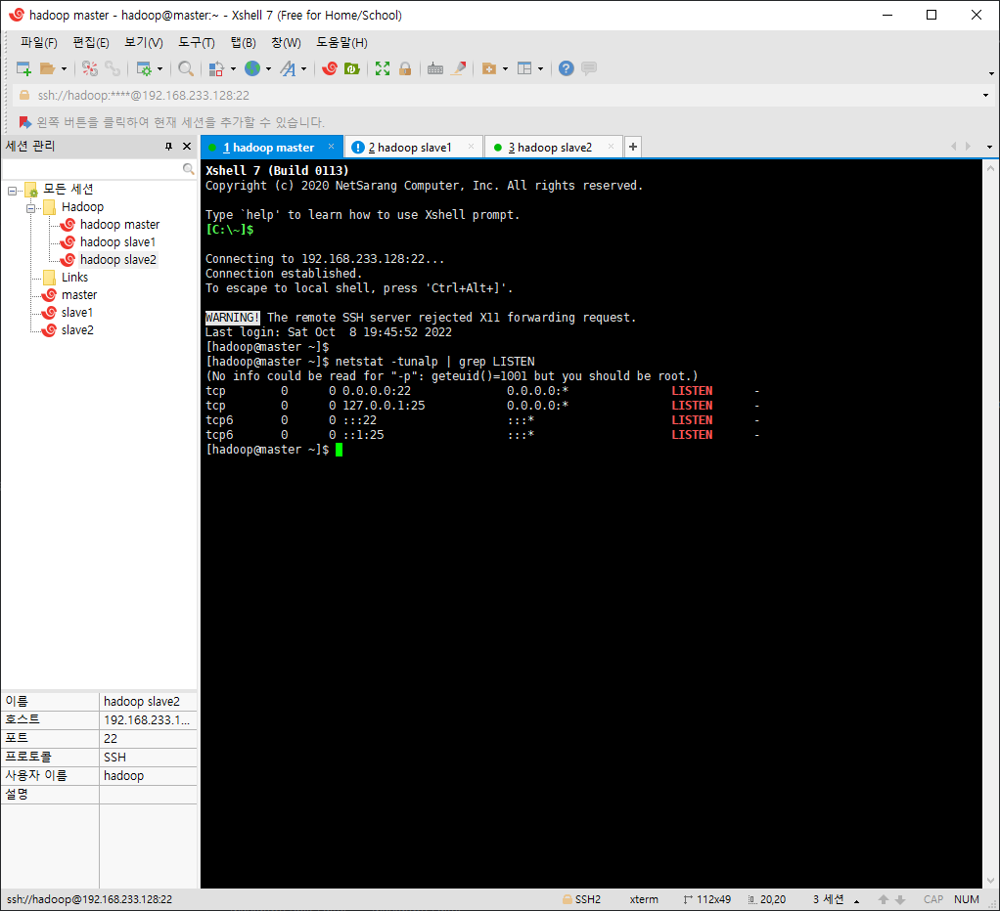

|    Date    |  Time   |
|:----------:|:-------:|
| 2022-10-06 | 오전 9:13 |

---

# 중간고사 예상 문제

**1. 하둡의 필수 구성요소 3가지를 작성하시오.**
```java
    1. 하둡 분산 파일 시스템 :
    2. 맵리듀스 : 
    3. 얀 :
 
    // 1장 60p
```

2. 호스트네임을 master로 변경하기 위한 명령어를 작성하시오.
```java
    hostnamectl set-hostname  호스트이름

    // hostname : 현재 호스트 이름 알려주는 명령어
    // 2장 38p
```

**3. 하둡과 같이 자바를 기반으로 실행되는 프로세스들을 확인하는 명령어를 작성하시오.**
```java
 
```

4. ifconfig 명령어를 사용하기 위한 데몬 설치 명령어를 작성하시오.
```java
    yum install -y net-tools

    // 2장 43p
```

5. SSH 프로토콜의 기본 포트는 몇 번인가?
```java
    22번 포트

    // 3장 7p
```

---
**6. 현재 열린 포트를 확인하기 위한 명령어는 무엇인가?**
```java
        netstat -tunalp | grep LISTEN
```

**7. CentOS 7의 8088번 포트의 외부 접속을 혀용하기 위한 방화벽 설정, 방화벽 재부팅, 방화벽 내용 확인 명령어를 작성하시오.**
```java
    - 방화벽 설정 명령어 : firewall-cmd --permanent --zone=public --add-port=포트번호/tcp
    - 방화벽 재부팅 명령어 : firewall-cmd --reload
    - 방화벽 전체 내용 확인 명령어 : firewall-cmd --list-all

    // 4장 87p
```


**8. 생성된 SSH키의 권한 설정 명령어를 작성하시오.**
```java

```

9. hadoop 계정의 sudo 권한을 부여하기 위해 수정하는 파일은 무엇인가?
```java
    sshd_config

    // vi /etc/ssh/sshd_config : 파일 수정 명령어
    // 3장 16p
```

10. 설치한 자바의 환경 설정하는 파일은 무엇이며, 설정 후 적용하기 위한 명령어는 무엇인가?
```java
    - 환경 설정 파일 : vi /etc/profile
    - 적용 명령어 : source /etc/profile
```
---
**11. 다음과 같은 폴더의 링크를 생성하기 위한 명령어를 작성하시오.**
 > - 현재 위치 : /
 > - 생성할 링크 위치 : /usr/local
 > - 링크명 : java
 > - 대상 폴더명 : /usr/local/jdk1.8
```java
    ln -s /usr/local/jdk1.8/ java
```

12. jdk1.8.tar.gz 파일의 압축을 해제하는 명령어를 작성하시오.  
```java
    tar -zxvf jdk1.8.tar.gz
```

13. 하둡의 네임노드를 포멧하기 위한 명령어를 작성하시오.
```java
format?
```

14. 하둡의 실행 관련 파일들이 존재하는 폴더는 무엇인가?
 > - 하둡 설치 경로 : /usr/local/hadoop
```java
    /usr/local/hadoop/sbin
```

15. 하둡의 환경 설정 관련 파일들이 존재하는 폴더는 무엇인가?
> - 하둡 설치 경로 : /usr/local/hadoop
```java
    /usr/local/hadoop/etc
```

---
16. hadoop 계정이 root 계정을 권한을 빌려와서 권한이 없는 파일을 실행, 수정하기 위한 명령어는 무엇인가?
```java
    sudo 
```

17. hadoop 계정으로 접속된 상태에서 root 계정으로 접속하기 위한 명령어는 무엇인가?
```java
    su - root
```

**18. DHCP에 대해 자세히 설명하시오.**
```java

```

19. vi편집기에서 맨 마지막 줄로 이동하는 단축키는 무엇인가?
```java
    shift + g
```


20. 하둡을 실행과 종료하는 명령어는 무엇인가?
```java
    - 실행 명령어 : ./start-all.sh
    - 종료 명령어 : ./stop-all.sh

    // cd /usr/local/hadoop/sbin : 하둡 실행 관련 명령어가 모인 폴더, 여기서 명령어를 쳐야한다.
```


---
21. 하둡 마스터 서버에 네임노드와 데이터노드의 역할을 부여했다고 가정했을 때, 하둡이 샐행될 때 실행되는 데몬을 모두 작성하시오.
```java
    jps
    namenode
    secondarynamenode
    datanode
    nodemanager
    
```

22. 하둡 슬레이브 서버에 데이터노드의 역할을 부여했다고 가정했을 때, 하둡이 샐행될 때 실행되는 데몬을 모두 작성하시오.
```java

```

23. 파일 업로드 및 다운로드를 쉽게 하기위한 데몬의 설치 명령어를 작성하시오.
```java

```


###빅데이터플랫폼 #예상문제