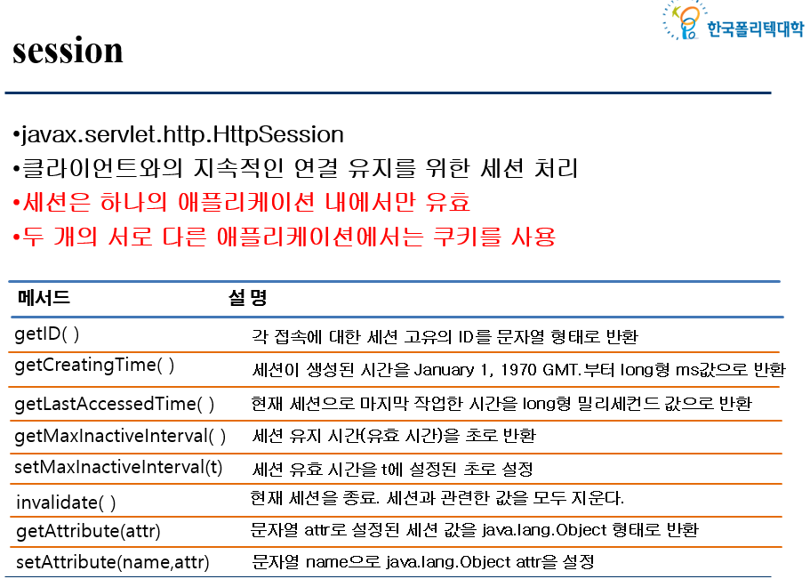

|    Date    |   Time   |
|:----------:|:--------:|
| 2022-10-12 | 오후 12:52 |

---

#JSP 내장 객체

## JSP 내장 변수(implicit variable) 
 > - JSP 내에서 선언하지 않고 사용할 수 있는 변수 (또는 객체)
 > - JSP 컨테이너에 의해 선언되어 있는 클래스의 인스턴스 이름 (컨테이너에 의해 자동 생성)
 > - JSP 에서 표현식, 스크립트릿에서 코드를 심플하게 만들어 줌 (<%>)
---

```java
        ★★★★★
        - request :
        - response :  
        - out :  
        - session :
        ★★★★★ 
```
---

 ```java
        ★★★★★
        getParameterNames() : input 타입이 너무 많을 때 (설문지에 많이 사용)
        getParamater(name) : input 타입의 name과 같아야한다. ( 1 대 1)
        getPatameterValues(name) : input 타입 태그 중에서 checkbox 타입에 사용 ( 여러가지 가져올 때 사용)
        ★★★★★

        getCookies() : Cookies() - 웹 브라우저 내에서 저장되는 정보, 저장되는 장소 = 브라우저(내 pc)
        getSession() : login 로직을 작성할 때 많이 사용, 저장되는 장소 = tomcat이 켜지고 있는 메모리에 저장 (내 pc가 아니라 서버에 저장)

        setCharacterEncording() : 인코딩을 강제로 바꿔야할 때 사용, 예전에는 시스템이 달라서 썼지만 지금은 다 UTF-8 이기 때문에 필요 X
        getContentLength() : 
 ```
---

```java
        setContentType() :
        크롬 같은 경우는 컨텐츠 타입을 보고 text/html 을 보고 text 형태의 html 이구나를 알 수 있다.
        중요한 이유 인터넷에서 다운 받을 때 내가 타입을 정하면 크롬에서 바꿔서 다운하게 해준다.
        sendRedirect(url) : document.location.href 랑 같은 친구
```
---

```java
        자바에서 다음 페이지로 이동하는 방식 2가지
        제일 중요한 차이점 : 전 페이지에서 가지고 있던 데이터를 가지고 가냐 안가냐
        
        sendRedirect(url) : 이전에 가지고 있던 데이터를 가져가지 않고 그냥 다음 페이지로 이동하는 방식
        forward(request, response) : 이전에 가지고 있던 데이터를 가지고 다음 페이지로 이동하는 방식

        스프링 같은 경우에는 페이지를 이동할 때 forward 방법을 사용 
        : request랑 response 데이터를 가지고 이동해야하기 때문에
```


---

```java
        getBufferSize() : 화면에 한번에 데이터를 보여주려면 오래 걸리는데 사용자가 기다리다가 나가기전에 뭐라도 보여주기 위해서 쓰는 방식
```
---

```java
        ★★★★★
        이 세션으로 로그인 처리를 제일 많이 한다.
        단점은 저장장소가 서버 ==> 서버 한대에 종속적이다.
        요즘 트렌드 
        이야스 : os를 그대로 복사하는 방식, 세션은 복사가 되지 않기 때문에 요즘엔 세션보단 쿠키를 쓴다. 
        -> 쿠키는 보안이 안좋기 때문에 또 나온게 토큰 방식이다...
        ★★★★★
```
---

## application
 : 서버 시작부터 끝까지 켜져있는 친구

---


 
