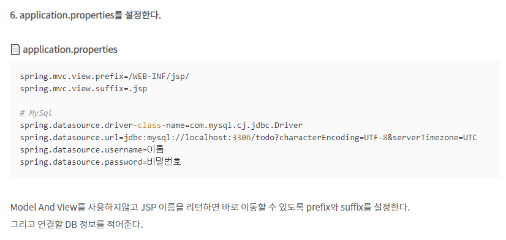

|    Date    |  Time   |
|:----------:|:-------:|
| 2022-10-07 | 오전 9:07 |

---

# 스프링 기초 

### 의존성 

> spring.mvc.view.prefix=/WEB-INF/jsp/
spring.mvc.view.suffix=.jsp

# MySql
spring.datasource.driver-class-name=com.mysql.cj.jdbc.Driver
spring.datasource.url=jdbc:mysql://localhost:3306/todo?characterEncoding=UTF-8&serverTimezone=UTC
spring.datasource.username=이름
spring.datasource.password=비밀번호

Model And View를 사용하지않고 JSP 이름을 리턴하면 바로 이동할 수 있도록 prefix와 suffix를 설정한다.

그리고 연결할 DB 정보를 적어준다.